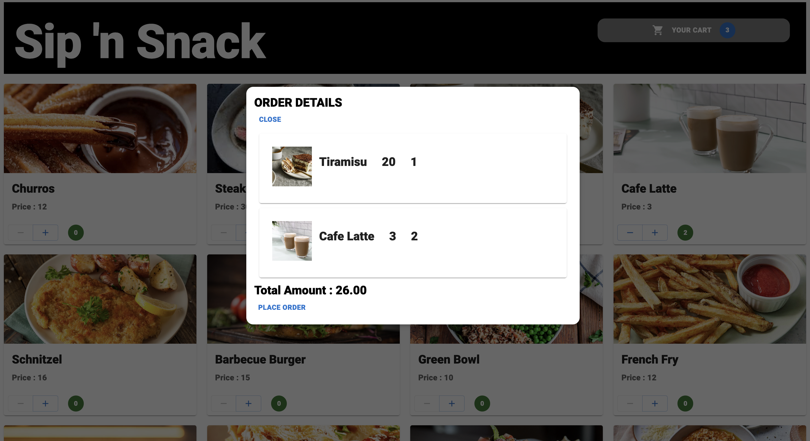

# Food Ordering Application

Developed a react based food ordering application with the usage of Redux for state management, RTK queries to make API calls and Firebase to store data. 

## Application User Interface

    
    

